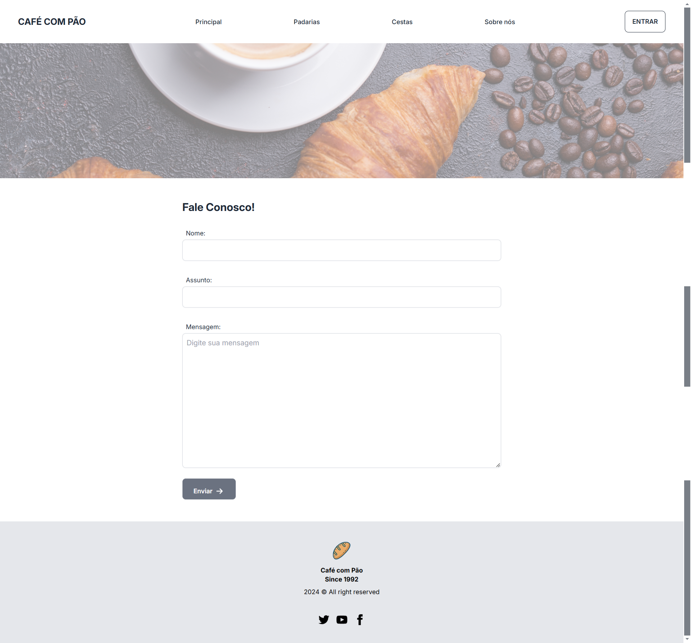

<p align="center"></p>


<h2 align="center"> 📝 Página de Formulário</h2>




## 📋 Descrição do Projeto
O projeto desenvolvido para a matéria de Desenvolvimento Web no curso de Ciência da Computação tem como ojetivo criar uma aba de opiniões em uma página fictícia, focando no aprendizado da tag *form*, HTML semântico e frameworks CSS. A interface inclui campos para nome, assunto e comentários, com um design responsivo e acessível, estilizado com um framework CSS para melhor usabilidade.

## 🔧 Tecnologias Utilizadas

- **HTML5** - Para a estrutura do conteúdo
- **CSS, Taillwind e DaisyUI** - Para a estilização 
- **Flexbox e Grid Layout** - Para a organização e disposição dos elementos

## 🚀 Funcionalidades

- Página de "De sua opnião" para o cliente opinar sobre assuntos específicos
- Formulário para contato

## 📂 Estrutura de Pastas

```bash
pagina-de-formulario/
│
├── assets/                # Pasta de ativos
│   └── css/               # Pasta de estilização
│   └── img/               # Pasta de imagens
├── index.html             # Página inicial
└── README.md              # Documentação do projeto
└── desafio.md             # Desafio proposto pelo professor
```

## 🖥️ Como Rodar o Projeto Localmente

1. Clone o repositório:

```bash
git clone https://github.com/sarahbeirigo/pagina-de-formulario.git
```

2. Navegue até o diretório do projeto:

```bash
cd pagina-de-formulario
```

3. Abra o arquivo `index.html` diretamente no navegador para visualizar o site.

## ✍️ Aprendizados

Neste projeto, aprofundei meu conhecimento em:

- Utilização de FrameWorks Css
- Boas práticas de semântica em HTML5
- Uso da tag forms

## 💡 Melhorias Futuras

- [ ] Design responsivo adaptado para diferentes tamanhos de tela (desktop e mobile)
- [ ] Implementação de lógica e funcinalidade para o forms utilizando JavaScript

## 📝 Contato

Se você quiser saber mais sobre o projeto ou entrar em contato:

 <a href = "mailto:sarahcbeirigo@gmail.com"></a>
  <a href="https://www.linkedin.com/in/sarah-beirigo/" target="_blank"></a> 

##
<p align="center">👩🏼‍💻 code by <a href="https://github.com/sarahbeirigo">Sarah Beirigo</a></p>
